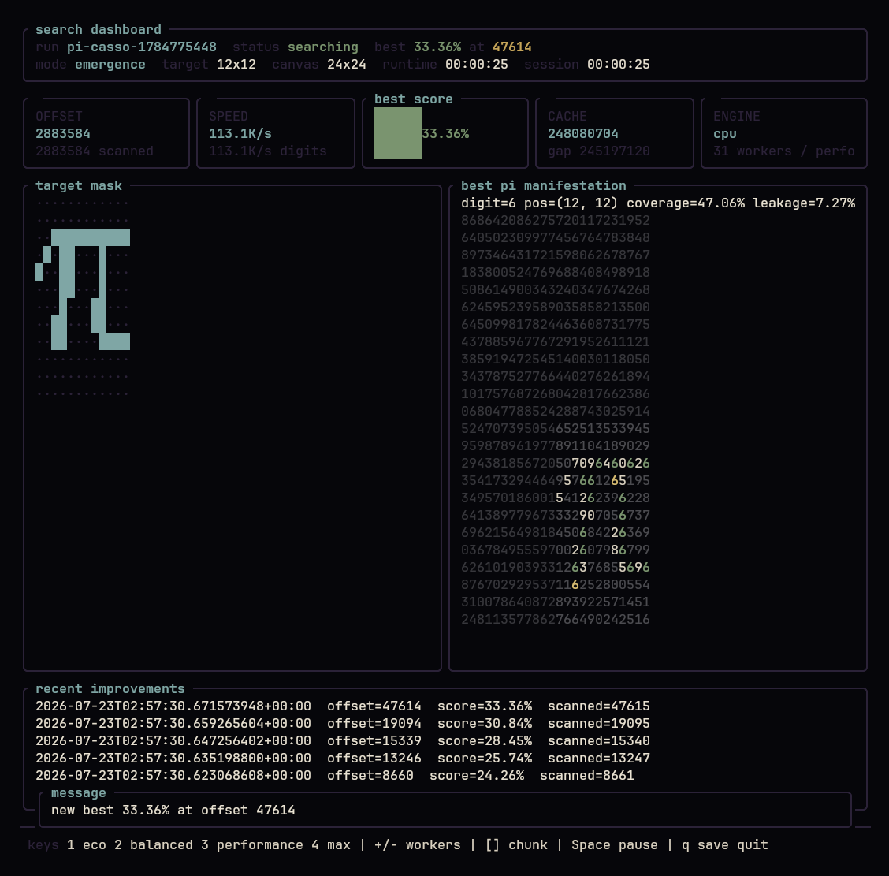

<div align="center">

# π-casso

### Finding pictures in π because useful software was apparently already taken

A fast, resumable Rust CLI and TUI that scans real digits of π for patterns resembling ASCII art.

[](#why)
[](https://github.com/Sir-Starch/pi-casso/actions/workflows/ci.yml)
[](https://www.rust-lang.org/)
[](#terminal-ui)
[](#performance-and-gpu)
[](#license)

[Quick start](#quick-start) ·
[How it works](#how-it-works) ·
[Commands](#command-reference) ·
[Performance](#performance-and-gpu) ·
[Contributing](#contributing)

</div>

> [!WARNING]
> `pi-casso` is a serious implementation of a fundamentally unserious idea.
> It searches actual digits, stores real progress, resumes honestly, and still
> provides no practical benefit whatsoever.

## Terminal UI

<p align="center">
  
</p>

The interactive interface includes a home screen, search wizard, saved-run
browser, template previews, digit import, live metrics, pause, checkpoints,
export, and safe quit controls. Humanity demanded dashboards even for searching
π for a tiny Arch logo, so here we are.

## Why

`pi-casso` asks one needlessly expensive question:

> Can a slice of π be interpreted as something resembling ASCII art?

The answer is usually “not very well,” but the search is reproducible,
resumable, and honest:

- digits are read from real local sources or generated into a persistent cache;
- failed searches remain failed searches rather than inspirational statistics;
- the best match and improvement history are stored in SQLite;
- endless hunts can continue until the machine, the user, or the universe gives up.

Perfect matches for large images are astronomically unlikely. This is not a bug.
It is the project’s only reliable source of long-term engagement.

## At a glance

| | |
| --- | --- |
| **Language** | Rust 2024 |
| **Interfaces** | Interactive TUI, plain terminal output, JSON export |
| **Input** | Generated π cache, local digit files, embedded demo sample |
| **Targets** | Built-in `arch` and `pi` templates or custom ASCII art |
| **Matching** | Emergence scoring and legacy threshold modes |
| **Persistence** | SQLite runs plus a reusable local π cache |
| **Acceleration** | Multithreaded CPU and optional `wgpu` compute |
| **Usefulness** | Statistically difficult to detect |

## Features

- Interactive terminal UI with live search metrics
- Built-in `arch` and `pi` ASCII-art templates
- Custom `.txt` artwork
- `8x8`, `12x12`, `16x16`, and custom target sizes
- Real generated digits of π with a persistent local cache
- Finite searches over local digit files
- Resumable runs and periodic checkpoints
- Best-match improvement history
- SQLite state under `$XDG_DATA_HOME/pi-casso/pi-casso.db`
- CPU resource and thermal controls
- Optional GPU emergence scoring through `wgpu`
- Plain output for scripts and servers
- JSON export
- Stress testing, because the joke apparently needed benchmarks

## Quick start

### Build

From the repository
```sh
cargo build --release
./target/release/pi-casso
```

Alternatively, install it locally:

```sh
git clone https://github.com/Sir-Starch/pi-casso.git
cd pi-casso
cargo install --path .
pi-casso
```

### Launch the TUI

```sh
./target/release/pi-casso
```

New interactive searches default to a `12x12` target inside an endless
generated-π workflow. No separate digit file is required.

### Start an endless hunt directly

```sh
pi-casso hunt --template arch --name arch-eternal --infinite
```

Resume it later:

```sh
pi-casso resume arch-eternal
```

### Run a bounded file search

```sh
pi-casso start \
  --template arch \
  --name arch-scan \
  --pi-file ./pi-digits.txt \
  --limit 1000000 \
  --no-tui
```

## How it works

The default matcher is `emergence`.

The target artwork becomes a binary shape mask:

- filled target pixels define the desired shape;
- empty pixels are background and mostly treated as “don’t care”;
- π remains a canvas of raw decimal digits rather than a thresholded bitmap.

For each candidate canvas, `pi-casso` tests every digit from `0` to `9` and
every target placement. A candidate scores well when one repeated digit covers
the target shape without leaking too much into its local background:

```text
coverage_density = coverage²
contrast = max(0, (coverage − leakage) / max(1 − leakage, ε))
cleanliness = 1 − leakage

score =
    0.70 × coverage_density
  + 0.20 × contrast
  + 0.10 × cleanliness
```

- **coverage** measures how completely the target shape is covered by one repeated digit.
- **leakage** measures how much that digit spills into the background.
- **contrast** rewards a noticeable difference between the shape and its background.
- **squared coverage (density)** penalizes incomplete shapes more heavily.

*(Special case: if `coverage == 1.0` and `leakage == 0.0`, the score is exactly `1.0`.)*

The target and digit canvas have separate dimensions. The default endless
search places a `12x12` target inside a `24x24` canvas:

```sh
pi-casso hunt --template arch --name arch-wall --infinite

pi-casso start \
  --template pi \
  --name pi-wall \
  --match-mode emergence \
  --mode 12x12 \
  --canvas-width 24 \
  --canvas-height 24 \
  --pi-file ./pi-digits.txt
```

### Legacy threshold matching

Threshold mode converts digits into a binary bitmap:

1. normalize the target art;
2. read a same-sized sliding window of π digits;
3. treat digits below the threshold as empty;
4. treat digits at or above the threshold as filled;
5. calculate `matching pixels / total pixels`.

With the default threshold of `5`, digits `0–4` are empty and `5–9` are filled:

```sh
pi-casso start \
  --template pi \
  --name pi-threshold \
  --match-mode threshold \
  --threshold 5 \
  --pi-file ./pi-digits.txt
```

Use `--invert` to compare against the inverted bitmap as well.

<details>
<summary><h2>Pi sources</h2></summary>

### Generated cache

Interactive and `hunt --infinite` searches use a persistent local π cache. If a
search catches up with the generator, it waits for more digits and resumes
automatically.

```sh
pi-casso pi generate --digits 1000000
pi-casso pi cache-info
pi-casso pi info
```

For larger generation jobs, `pi-casso` can invoke
[y-cruncher](https://www.numberworld.org/y-cruncher/):

```sh
pi-casso pi generate \
  --digits 1000000000 \
  --generator-backend y-cruncher \
  --y-cruncher-path /path/to/y-cruncher \
  --workers 32
```

Generated output is normalized and appended to:

```text
$XDG_DATA_HOME/pi-casso/pi-cache.txt
```

Temporary y-cruncher output is removed after import. With
`--generator-backend auto`, y-cruncher is used when available; otherwise
`pi-casso` falls back to its built-in CPU generator.

### Local digit files

Finite searches accept text files containing digits of π. ASCII whitespace is
ignored:

```text
3141592653 5897932384
6264338327 9502884197
```

Other characters are rejected by default, including the decimal point in
`3.1415`. This catches accidental formatting rather than silently shifting every
offset.

Use `--allow-decimal-prefix` only for files intentionally beginning with `3.`:

```sh
pi-casso start \
  --template arch \
  --name arch-file \
  --pi-file ./pi-digits.txt \
  --allow-decimal-prefix
```

Import an existing file into the generated cache:

```sh
pi-casso pi import ./pi-digits.txt
pi-casso pi import ./pi-with-prefix.txt --allow-decimal-prefix
```

### Demo sample

When a finite `start` command has no `--pi-file`, `pi-casso` uses a tiny embedded
sample and prints a warning. It is intended for smoke tests and previews, not
for finding enlightenment in the first few digits.

</details>

## Templates and custom art

List built-in templates:

```sh
pi-casso templates
```

Preview one:

```sh
pi-casso preview --template arch
pi-casso preview --template arch --mode 12x12
```

Built-in sources:

- [Arch Linux artwork](https://archlinux.org/art/)
- [ASCII Pi](https://legend-of-iphoenix.github.io/ascii-pi/)

Preview custom art:

```sh
pi-casso preview --file ./cat.txt --width 16 --height 16
```

By default, spaces are empty and visible characters are filled:

```text
 /\_/\
( o.o )
 > ^ <
```

Explicit character mappings are also supported:

```sh
pi-casso preview --file ./cat.txt --empty " ." --filled "#@"
```

Artwork is trimmed, resized using nearest-neighbor sampling, and padded to
preserve its aspect ratio where possible. Sophisticated image processing would
only make this whole activity harder to defend.

## Command reference

### Search lifecycle

| Command | Purpose |
| --- | --- |
| `pi-casso` | Open the interactive TUI |
| `pi-casso start ...` | Start a finite search |
| `pi-casso hunt ... --infinite` | Start an endless generated-π search |
| `pi-casso resume <name>` | Continue from the latest checkpoint |
| `pi-casso status <name>` | Show saved run status |
| `pi-casso show-best <name>` | Render the current best match |
| `pi-casso history <name>` | Show best-match improvements |
| `pi-casso export <name> --format json` | Export a run |
| `pi-casso delete <name>` | Delete a saved run |

### Useful examples

```sh
pi-casso start --template arch --name arch-hunt --pi-file ./pi-digits.txt
pi-casso start --template arch --name arch-small --mode 8x8 --pi-file ./pi-digits.txt

pi-casso start \
  --file ./cat.txt \
  --name cat-hunt \
  --width 16 \
  --height 16 \
  --pi-file ./pi-digits.txt \
  --limit 1000000 \
  --no-tui
```

### Search limits

A search normally stops when:

- a 100% match is found;
- its finite digit source is exhausted;
- the user interrupts it.

Bound it explicitly with either scanned-window count or an exclusive maximum
offset:

```sh
pi-casso start \
  --template arch \
  --name arch-scan \
  --pi-file ./pi-digits.txt \
  --limit 500000

pi-casso start \
  --template pi \
  --name pi-scan \
  --pi-file ./pi-digits.txt \
  --max-offset 10000000
```

<details>
<summary><h2>Performance and GPU</h2></summary>

The default `balanced` profile controls worker count, chunk size, throttling,
checkpoint cadence, memory budget, and TUI refresh rate without changing search
correctness.

| Profile | Intended use |
| --- | --- |
| `eco` | Laptops, weak hardware, and background searches |
| `balanced` | Moderate CPU use and normal UI refresh |
| `performance` | Strong desktops and faster scanning |
| `max` | All-out search-flavoured stress test |
| `custom` | Balanced defaults with manual overrides |

```sh
pi-casso hunt --template arch --name arch-eco --infinite --profile eco

pi-casso hunt \
  --template arch \
  --name arch-fast \
  --infinite \
  --profile performance \
  --backend auto

pi-casso hunt \
  --template arch \
  --name arch-custom \
  --infinite \
  --profile custom \
  --cpu-workers 8 \
  --chunk-size 2000000 \
  --cpu-utilization 90
```

`max` and stress-test modes require acknowledgement. In non-interactive use,
pass `--yes` or `--force`:

```sh
pi-casso hunt --template arch --name arch-max --infinite --profile max --yes
pi-casso stress-test --stress-target cpu --stress-duration 60 --yes
```

### Resource controls

```text
--cpu-workers <n>
--cpu-utilization <1-100>
--chunk-size <n>
--queue-depth <n>
--memory-limit-mb <n>
--ui-refresh-ms <n>
--max-fps <n>
--thermal-mode quiet|normal|aggressive
--background-yield-ms <n>
--pause-when-on-battery
```

### GPU backend

The default emergence matcher can evaluate candidate `(window, placement)`
scores in a `wgpu` compute shader.

- `--backend auto` keeps small searches on the optimized CPU path and switches
  to GPU for larger emergence or stress workloads;
- `--backend gpu` or `--gpu on` requests GPU explicitly;
- initialization failures fall back cleanly to CPU;
- legacy threshold and exact modes remain CPU-only because transfer overhead
  usually outweighs the work;
- decimal π generation remains CPU-oriented.

```sh
pi-casso gpu info
pi-casso benchmark --template arch --seconds 10 --profile eco
pi-casso benchmark --template arch --seconds 10 --profile performance --backend auto
```

### TUI controls

| Key | Action |
| --- | --- |
| `1` / `2` / `3` / `4` | Select `eco`, `balanced`, `performance`, or `max` |
| `p` or `Space` | Pause or resume |
| `g` | Cycle GPU mode |
| `+` / `-` | Adjust workers |
| `]` / `[` | Adjust chunk size |
| `t` | Cycle thermal mode |
| `m` | Toggle metrics |

The dashboard displays the active profile and backend, generator backend,
workers, CPU target, GPU device or fallback state, chunk size, queue depth,
estimated memory, thermal mode, cache gap, and throughput. Apparently even
pointlessness needs observability.

</details>

## Plain output example

```text
[00:01:42] offset=182400000 scanned=182399744 speed=2.1M/s best=87.50% at offset=91441203

new best: 91.80% at offset 918273645 after 918273646 scanned windows
....##..........
...####.........
..#####.........
.###..###.......
###.....##......

finished: limit reached (offset=1000000, scanned=1000000, best=91.80%)
progress saved. Resume will continue from the current offset.
```

<details>
<summary><h2>Storage and architecture</h2></summary>

Digit input is abstracted behind `DigitSource`. File, demo, cache, and generated
sources can share the same search pipeline.

Progress is stored in SQLite:

```text
$XDG_DATA_HOME/pi-casso/pi-casso.db
```

`resume` continues from `current_offset`, never from the best-match offset.
Best-match improvements are written immediately, while periodic checkpoints
persist scan progress.

At a high level:

```text
ASCII target
    ↓ normalization
binary target mask
    ↓
π digit source → sliding candidate canvases
    ↓
CPU or GPU matcher
    ↓
best-match updates + checkpoints
    ↓
TUI / plain output / JSON export
```

</details>

## Project status

`pi-casso` is an experimental meme project. It may change rapidly, consume
unreasonable amounts of compute, and produce screenshots far more valuable than
its results.

The project does make several things deliberately non-joke-grade:

- input validation;
- deterministic matching semantics;
- honest offsets and scanned ranges;
- persistent checkpoints;
- clean CPU fallback;
- reproducible exports.

There is currently no promise of stable CLI compatibility, package
availability, or any eventual moment at which the search becomes sensible.

## Contributing

Bug reports, performance measurements, platform fixes, and improvements to the
TUI are welcome.

Before submitting changes:

```sh
cargo fmt --all -- --check
cargo clippy --workspace --all-targets --all-features -- -D warnings
cargo test --workspace --all-features
```

Changes that invent digits, fabricate search results, or make the project
genuinely useful will be reviewed with appropriate suspicion.

## License

Licensed under either:

- [Apache License 2.0](LICENSE-APACHE)
- [MIT License](LICENSE-MIT)

at your option.

Unless explicitly stated otherwise, contributions intentionally submitted for
inclusion are dual-licensed under the same terms without additional conditions.
